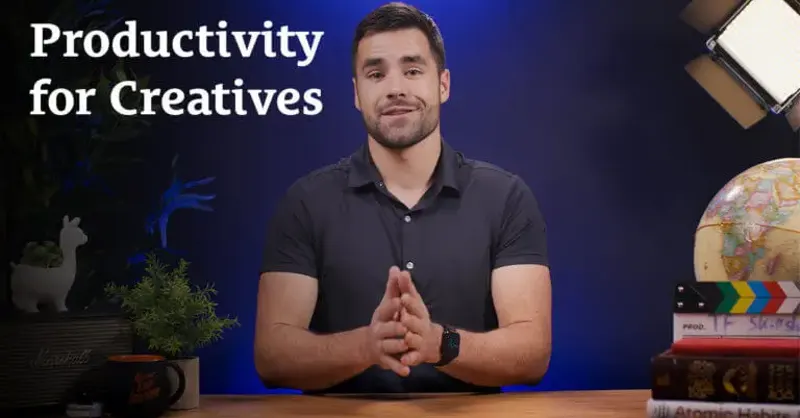

# Thomas Frank’s Creative Journey 🔭

If you’re using Notion professionally, and ever needed to Google how to do something in Notion, chances are high that you have stumbled upon **Thomas Frank**.

Thomas is one of the most popular productivity YouTubers world-wide, among the ranks of Matt D’Avella and Ali Abdaal. His main YouTube channel now amasses 2.5+ million subscribers, while his secondary blooming channel about Notion specifically is currently at ~100K - an amazing number given how niche of a topic Notion still is.
Thomas’ relatability, charisma, and fascination with building systems are what attracts fans to his work, and he has built a genuine and supporting following over the years.

<!--  -->

  

I personally started interacting with his content in my high school years, so around 2015-2016.

He was one of the first YouTubers I saw that were explaining topics such as productivity, study techniques, folder organisation, email management, etc. in a light-hearted and easy-to-follow manner. His short e-book “**[10 Steps to Earning Awesome Grades](https://collegeinfogeek.com/)**” also greatly inspired me to actually do well academically. From then on, Thomas has been branching out of the field of general productivity and in more niche topics such as Notion, personal finances, and life management. His messages are partially what inspired this blog series as well - *using engineering principles to achieve wealth, health, and prosperity*.

In this article, we will go over Thomas Frank’s journey as a creator, and we’ll pinpoint his exact successful strategies over the years. Surely this would be helpful to any new creator on the digital scene. Now, drums please, and let’s go into Thomas Frank’s first venture into the digital content world…

## *College Info Geek* and book-writing

“College Info Geek” is the platform that Thomas Frank  was initially using to publish his content.

The main focus were study articles specifically geared towards college students but very helpful to all types of students regardless. These articles were often accompanied by videos, where Thomas Frank’s charisma and talent really shone. He created elaborate and detailed guides on how to do well on exams, take on your student loans and how to find your 1st job in the market.  

This collection of articles and guides ultimately led to him creating a full-fledged digital product - his book, “10 Steps to Earning Awesome Grades”.

It is still available for free on his website, as it always has. This is what fascinated me as a student - who creates such an awesome and actually helpful guide just to distribute it for free?

A smart guy, that’s who.

Thomas realised something about his main audience of students. They aren’t among the best-paid classes, and pushing a paid product to such an audience will likely result in backlash. Other creators like Ali Abdaal frequently receive backlash when they promote their courses that cost hundreds of dollars, despite the fact that nobody is obligated to buy those products in the 1st place. So if Thomas had listed this product as a paid one, it would likely attract a much lower level of interest.

Meanwhile, now that it was free, us students could just mention the book to a friend and they would have the ability to view it obstacle-free. This is how I got many of my friends to know about Thomas Frank’s work. His free content was powerful enough to attract an audience of grateful students, that would later keep up-to-date with his other work as they advanced through uni/college.

And while all [those e-materials are still out there](https://collegeinfogeek.com/start/), Thomas has been deviating from the study niche for quite a while. And this also has its strategic importance as he said so himself. The more time passes since he has last been in academia himself, the larger the gap becomes between himself and his target audience. This could potentially lead to a disconnect between him and his audience, so he decided to venture out into open waters - turning his attention to YouTube.

## YouTube - A career in action

Thomas Frank is currently most popular with his YouTube content.

His content that was initially geared towards students was now applicable to a more general audience. He started routinely publishing content around his productivity habits, goal-setting, and he kept on providing valuable tech tips. Here are just a few of the topics he covered:

- Tech setups
- Self-discipline
- Online learning
- Lifelong learning
- Working from home
- Motivation and dopamine
- Stress and procrastination
- Athletism
- Writing (essays, articles, books)

His popularity started really skyrocketing. His relatability and principles-first approach to work made him stand out. Plus, unlike some other productivity Youtubers that didn’t necessarily have the basis on which to build, Thomas already had a few years of experience with content creation and his YouTube brand was a natural continuation of that.

> So what did he do right?

It’s difficult to pinpoint exactly at what point his channel took off - and that’s the cool part.

Unlike some other YouTubers, Thomas seems to rely very little on the algorithm to produce content. He has a schedule and style of work that helps him consistently produce high-quality work with consistently high view-rates.

What is more, his content rarely relies on some current events to keep going - making it relatively timeless in nature. You can find some tips and tricks from his content both as a teen and as a working adult, which is a strong quality.

Thomas has realised the potential of the Notion niche. It is full of dedicated and curious people, and since Notion is a relatively young software, it attracts an ever-growing audience. What is more, there is an urgent need for more tutorials being made, as Notion releases more and more features. This is where Thomas found a great market fit - his already-existing expertise on video-making and teaching combined with his genuine passion for Notion make him one of the best-suited people to enter this market.

What is even more exciting, is that the Notion team apparently regularly talks with Thomas on what can be included or fixed with the software. Since Thomas has such a big audience that greatly overlaps with the Notion one, it only makes sense for both parties to be interested in working with each other.

Thomas Frank and his overall experience with content creation of all kinds makes him a person to look up to, so I suggest you give him a follow on Twitter to stay in the loop.

<blockquote
        style="justify-self: center; align-self: center"
        class="twitter-tweet twitter-tweet-rendered"
      >
        

          I just made $100,000 in a single month selling
          <a href="https://twitter.com/NotionHQ?ref_src=twsrc%5Etfw"
            >@NotionHQ</a
          >
          templates through
          <a href="https://twitter.com/gumroad?ref_src=twsrc%5Etfw"
            >@Gumroad</a
          >. Here&#39;s how:  - Built an audience w/ tutorials and
          free templates - Spent a LOT of time on the sales page -
          Product bundles - Upgraded the customer experience
          everywhere  Here are the details:
          <a href="https://t.co/uTMAmXq70E">pic.twitter.com/uTMAmXq70E</a>
        

        &mdash; Thomas Frank (@TomFrankly)
        <a
          href="https://twitter.com/TomFrankly/status/1523730922633191424?ref_src=twsrc%5Etfw"
          >May 9, 2022</a
        >
</blockquote>

